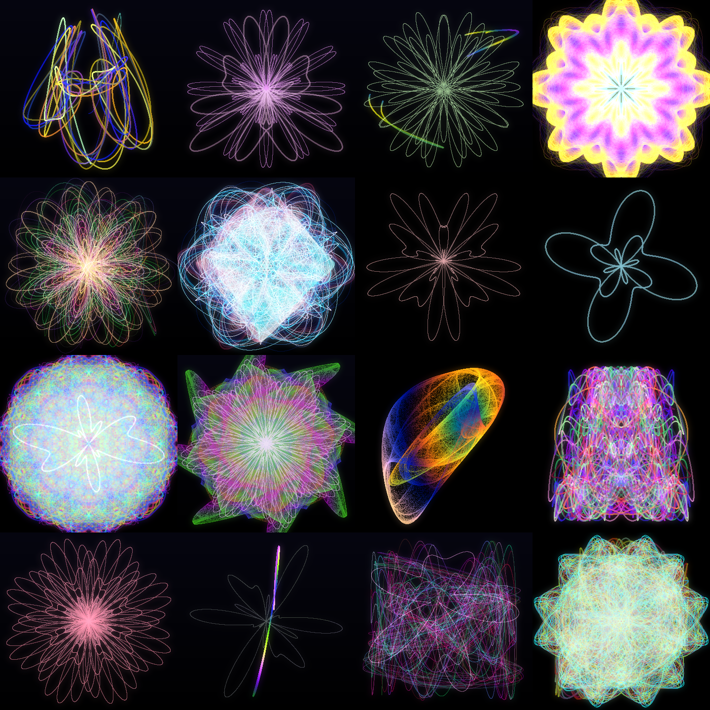

# Moteur d'Art Génératif Mathématique

Un moteur créatif qui génère des œuvres originales à partir d'équations
mathématiques. Chaque œuvre est unique mais appartient à une même famille
visuelle reconnaissable. Une œuvre est entièrement définie par son **génome
mathématique** : une seed suffit à la reconstruire au pixel près.



## Philosophie

- Les équations ne sont **pas codées en dur** : elles sont générées à partir de
  paramètres tirés d'une seed déterministe.
- Une œuvre = un `ArtworkGenome` sérialisable en JSON → reproductibilité totale.
- Un **modèle unifié** : toute famille d'équations produit un nuage de points 2D
  + une valeur de coloration, rendu par accumulation lumineuse. C'est ce qui
  donne à toutes les œuvres une identité de famille commune.

## Installation

```bash
python -m venv .venv
.venv/Scripts/activate        # Windows ;  source .venv/bin/activate sous Unix
pip install -e ".[dev]"
```

Dépendances : Python 3.12+, NumPy, Pillow, Matplotlib (export vectoriel SVG/PDF).
L'éditeur graphique utilise Tkinter (bibliothèque standard, aucune installation).

## Utilisation

### Ligne de commande

```bash
# Une œuvre depuis une seed (aléatoire si omise)
art-generator gen --seed 42 --size 1600 --out outputs

# Résolutions HD/4K/8K/16K, ratio et format (PNG/TIFF/JPG, SVG/PDF vectoriel)
art-generator gen --seed 42 --preset 4k --ratio 16:9
art-generator gen --seed 42 --preset 8k --format svg

# Un lot d'œuvres
art-generator batch -n 8 --out outputs

# Re-rendre une œuvre depuis son génome JSON (tuiles auto pour les très grandes tailles)
art-generator render outputs/genome_42.json --preset 16k

# Éditeur graphique : aperçu temps réel, presets, navigation, sauvegarde/chargement
art-generator ui --seed 42
```

### API Python

```python
import art_generator as ag

genome, image = ag.render_seed(42)
image.save("oeuvre.png")

# ou pas à pas
genome = ag.generate(seed=42, width=2000, height=2000)
image = ag.Engine().render(genome)
```

### Éditeur graphique

```bash
art-generator ui            # ou : art-generator ui --seed 42
```

Un atelier interactif (Tkinter, aucune dépendance supplémentaire) en trois
colonnes :

- **Réglages globaux** — changement de seed (précédent/suivant/aléatoire),
  *Nouveau (vierge)* pour repartir d'un canevas vide, bibliothèque de presets,
  ouverture/enregistrement JSON, export image pleine résolution, fond.
- **Aperçu temps réel** — rendu réduit *fidèle* à l'œuvre finale (grâce à
  l'indépendance à la résolution), calculé hors du thread principal et débouncé
  pour rester fluide pendant l'édition.
- **Éditeur de couche** — ajout/suppression de couches (jusqu'au canevas vide),
  famille d'équation, mode de fusion, médium (light/ink), opacité, glow,
  exposition, épaisseur, symétrie, bruit, palette.

Deux mouvements de **navigation dans l'espace des génomes** : *Muter* (petit pas
vers un voisin, la forme est préservée) et *Re-tirer les formes* (nouvelles
formes viables, même mise en scène).

### Web UI

```bash
python scripts/build_web.py
python -m http.server 8000 --directory public
```

### Planche-contact

```bash
python -m art_generator.examples.generate_gallery --seeds 1-16 --tile 400
```

## Architecture

```
art_generator/
├── core/         # génome, RNG déterministe, moteur, fond, modes de fusion
├── equations/    # familles d'équations (registre extensible)
│   ├── parametric.py     courbes paramétriques harmoniques
│   ├── polar.py          roses, rosaces, spirales
│   ├── attractors.py     Clifford, de Jong, attracteurs personnalisés
│   ├── vector_field.py   champs de vecteurs (advection de particules)
│   ├── complex_map.py    transformations conformes du plan complexe
│   ├── fractal.py        Mandelbrot / Julia en Buddhabrot (orbites)
│   └── particles.py      systèmes de particules (émetteurs, forces, curl)
├── noise/        # bruits procéduraux : Perlin, Simplex, fBm, Worley (warp & couleur)
├── generators/   # génération + viabilité + navigation dans l'espace des génomes
├── palettes/     # palettes procédurales (cosinus, HSV/HSL, harmonies, dégradés)
├── renderers/    # accumulation lumineuse + symétries + déformation par bruit
├── exporters/    # export image/vectoriel (SVG/PDF) + sérialisation JSON du génome
├── utils/        # cadrage robuste, nettoyage des singularités
├── presets/      # bibliothèque de presets (seeds curées + presets utilisateur)
├── ui/           # éditeur graphique Tkinter + aperçu (logique sans toolkit)
└── examples/     # scripts de démonstration
```

**Ajouter une famille d'équations** : implémenter une classe `Equation` et
l'enregistrer dans `equations/registry.py`. Rien d'autre n'a besoin d'être
modifié — ni le moteur, ni le renderer, ni le générateur.

## Reproductibilité

- Même seed → pixels identiques.
- Génome JSON rechargé → œuvre identique.

Ces deux garanties sont couvertes par la suite de tests (`pytest`).

## Feuille de route

Voir [ROADMAP.md](ROADMAP.md). **Livré** : bruit (Perlin/Simplex/fBm/Worley),
champs de vecteurs, domaines complexes, fractales, particules, composition par
alpha & encre, export vectoriel (SVG/PDF), résolutions HD→16K par tuiles,
interface graphique & navigation. **À venir** : performance & accélération GPU
performance & accélération GPU, animation et export temporel GIF/MP4.
